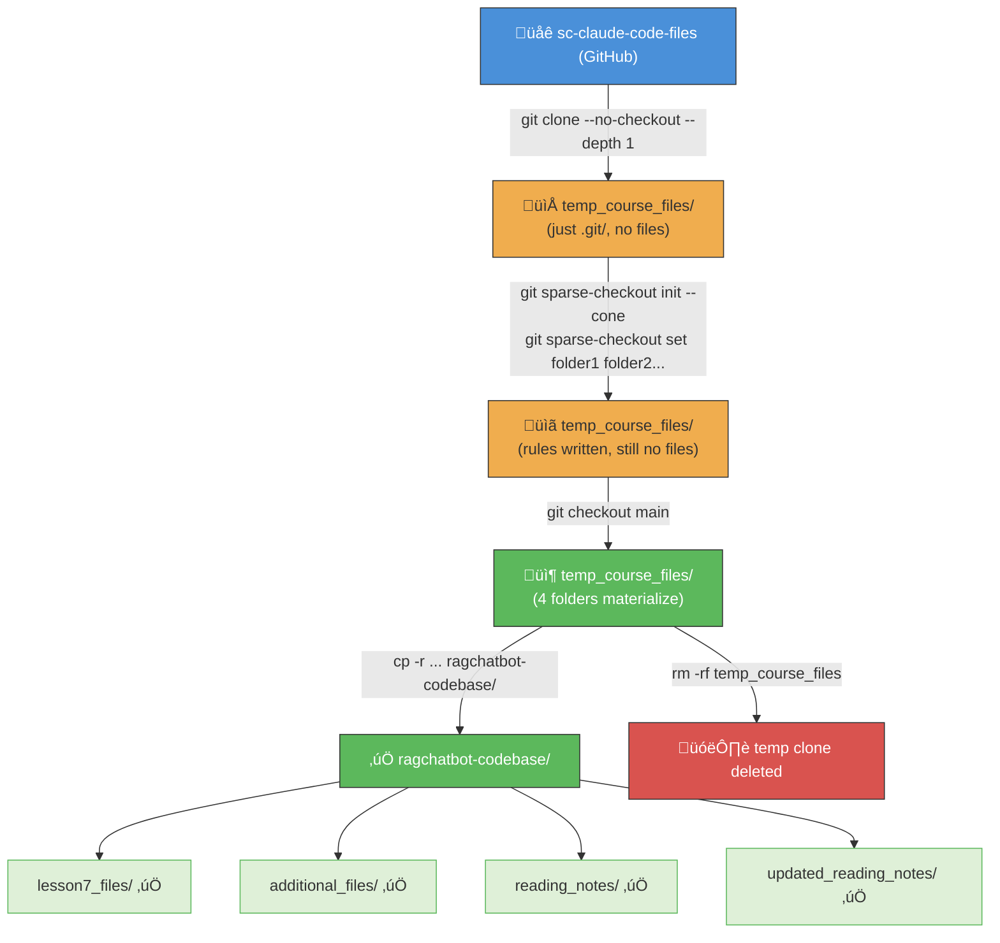

# Course Materials RAG System

A Retrieval-Augmented Generation (RAG) system designed to answer questions about course materials using semantic search and AI-powered responses.

## Overview

This application is a full-stack web application that enables users to query course materials and receive intelligent, context-aware responses. It uses ChromaDB for vector storage, Anthropic's Claude for AI generation, and provides a web interface for interaction.


## Prerequisites

- Python 3.13 or higher
- uv (Python package manager)
- An Anthropic API key (for Claude AI)

## Installation

1. **Install uv** (if not already installed)
   ```bash
   curl -LsSf https://astral.sh/uv/install.sh | sh
   ```

2. **Install Python dependencies**
   ```bash
   uv sync
   ```

3. **Set up environment variables**
   
   Create a `.env` file in the root directory:
   ```bash
   ANTHROPIC_API_KEY=your_anthropic_api_key_here
   ```

## Running the Application

### Quick Start

Use the provided shell script:
```bash
chmod +x run.sh
./run.sh
```

### Manual Start

```bash
cd backend
uv run uvicorn app:app --reload --port 8000
```

The application will be available at:
- Web Interface: `http://localhost:8000`
- API Documentation: `http://localhost:8000/docs`

## Claude Code Memory Files

Claude Code reads instructions from three memory file locations. Each serves a different scope:

### 1. Project Memory (Shared with team, committed to Git)
```bash
# File: ./CLAUDE.md (root of the project)
# Scope: Everyone who clones this repo gets these instructions
# Example content:
cat CLAUDE.md
```
Use this for project-wide rules like architecture decisions, coding standards, and build commands.

### 2. Local Project Memory (Personal, NOT committed to Git)
```bash
# File: ./CLAUDE.local.md (root of the project)
# Scope: Only YOU on this machine. Add to .gitignore.
# Create it:
echo "# Local Memory" > CLAUDE.local.md
echo "- Always use uv, never pip" >> CLAUDE.local.md
```
Use this for personal preferences that shouldn't affect other developers (e.g., "use vim keybindings", "always use uv").

### 3. User Memory (Global, applies to ALL projects)
```bash
# File: ~/.claude/CLAUDE.md (your home directory)
# Scope: Every project you open with Claude Code on this machine
# Create it:
mkdir -p ~/.claude
echo "# Global Memory" > ~/.claude/CLAUDE.md
echo "- Prefer concise responses" >> ~/.claude/CLAUDE.md
```
Use this for universal preferences like response style, preferred language, or global coding conventions.

-----

# Understanding and notes from the lesson till FRED-dashboard

# In terminal, in projects folder 

`./run.sh`

http://127.0.0.1:8000/

PORT = 8000

# claude code

`curl -fsSL https://claude.ai/install.sh | bash`

## Disk Space

In terminal:

`ollama list`

see model CPU/GPU usage
`ollama ps && ollama show qwen3-coder:30b` (FAILS)

`df -h /`

`du -sh ~/.ollama/models`

general disk space
`du -h -d 1 ~ | sort -h`

npm cache
`npm cache clean --force`

## Launch claude without pro/max/enterprise key or api

`ollama launch claude --config`

Checking MEMORY

`top -l 1 -o cpu -n 5 && echo "--- MEMORY ---" && top -l 1 -o mem -n 5 && echo "--- SWAP ---" && vm_stat | grep "Pageout"`

`ps aux | grep ollama | grep -v grep`

`ollama pull qwen2.5-coder:7b` (DUMB model)

`ollama rm gemma3:4b` (DUMB model)


(FOR ~16GB RAM)
Check the parameter size (B): Multiplying the "B" number by 0.7 gives you the approximate GB of RAM it needs.
7B x 0.7 = ~5 GB (Safe ‚úÖ)
14B x 0.7 = ~10 GB (Risky/Slow ⚠️ - leaves only 6GB for macOS)
30B x 0.7 = ~21 GB (Impossible ‚ùå - will freeze)


Diagrammatic representation of flow =

D3.js or recharts (web app)

  A[User Input] --> B[State Update: handleQueryChange];   
  
    B --> C[Redux Store Update];     
    
    C --> D[Dispatching Action: fetchData];   
    
    D --> E[Axios API Call];        
    
    E --|{FETCH_DATA_SUCCESS}| F[Express Server Middleware];
    
    E --|{FETCH_DATA_FAILURE}| G[Error Handling & Response];
    
    F --> H[Data Fetching: MongoDB Query];
    
    H --|{Success}| I[Data Processing & Sending];
    
    H --|{Failure}| J[Error Handling & Response];
    
    I --|{Success}| K[API Response Handling];
    
    K --> L[Data Update & Display];
    
    G --> K;
    
    J --> K;

https://app.eraser.io/workspace/icUk39WGeHzHH7gCtFKN?origin=share


## Claude Code 

`/init` = memory; analyze codebase to understand what it should know every time running the code

Claude.md = lint, memory


find . -name "*.json" -o -name "Makefile" -o -name "tox.ini" -o -name "pytest.ini" -o -name ".env*" 2>/dev/null  

`/ide` = sets VScode connection with claude code in terminal; context of certain files and asking questions is possible

`#` for setting memory in claude code [only with max or pro. not free models]

Eg, "# always use uv to run the server and dont use pip directly"
./CLAUDE.local.md = Project memory (local), 
~/.claude/CLAUDE.md = user memory in, \project memory in ./CLAUDE.md . Add all three       
  options in readme with code  

`/help`
`/memory`
`/mcp`
`/agents`
`/clear` = clear context window and start fresh
`/compact` = clear the history but keep a summary


PLAN MODE = SHIFT+TAB*2
ACCEPT EDITS = SHIFT+TAB

Eg, The chat interface displays query responses with source citations. 
I need to modify it so each source becomes a clickable link that opens the corresponding lesson video in a new tab: 
- When courses are processed into chunks in @backend/document_processor.py, the link of each lesson is stored in the course catalog collection
- modify _format_results in @backend/search_tools.py so that the lesson links are       
  also returned
- the links should be embedded invisibly (no visible URL text) 


## .vscode 

`settings.json`
{
    "python.analysis.typeCheckingMode": "basic"
}

## Push to Github from CLI

`git add .`

`git commit -m "..."`

`git push origin main`


## MCP Tool call to claude code

gain additional functionality to external sources and systems

eg, Playwright
`claude mcp add name_of_mcp underlying_command_to_start_mcp`
`claude mcp remove name_of_mcp`

name_of_mcp = playwright
underlying_command_to_start_mcp = npx @playwright/mcp@latest

## Claude Code prompt for frontend= 

"using the playwright mcp server visit *site_we_are_at* and view the new chat button. I want that button to look the same as the other links below for Courses and Try asking. Make sure that it is left aligned and that the border is removed."

site_we_are_at = http://127.0.0.1:8000/


NOTE: Models like mistral-nemo:latest and qwen2.5-coder:7b failed to work with tools like /mcp and follow simple guidelines like making a flowchart, or accessing multiple folders like @frontend and @backend. Would suggest get an ANTHROPIC_API_KEY.

## Claude Code prompt for frontend

"In @backend/search_tools.py, add a second tool alongside the existing content related tool. This new tool should handle course outline queries - 
1. functionality:
   a. input:course title,
   b. output:course title, course link, and complete lesson list,
   c. For each lesson, add lesson number and lesson title.

2. Data source : course metadata collection of the vector store.

3. Update the system prompt in @backend/ai_generator so that the course title, course link, the number and the title of each lesson are all returned to address and outline related queries.

4. Make sure that the new tool is registered in the system."


## Testing and Debugging

(Shift+Tab)*2 for plan mode
"Think a lot" = extended thinking mode in Claude

Prompt = 
"The RAG chatbot returns query failed for any content related questions. I need you to:
1. write tests to evaluate the outputs of the execute method of the course search tool in @backend/search_tools.py
2. Write tests to evaluate if @backend/ai_generator.py correctly calls for the CourseSearchTool
3. Write tests to evaluate how the RAG system is handling the content query related questions.

Save the tests in a test folder within at backend. Run those tests against the current system to identify which components are failing. proposed fixes based on what the test reveal is broken. Think a lot."


## Working on many features in parallel and ensuring we dont duplicate

Make your own custom command= 

- create implement-feature.md
- if arguments to pass to custom command use `$`. eg, `$ARGUMENTS`
- something applied to every instamce = use CLAUDE.md
- use specific commands that you may or may not use across different conversations

`/permissions` on Claude code CLI
OR 
settings.local.json = set permissions and deny


## Worktrees

Work in parallel with claude code

- create copies of the codebase
- operate in isolation
- merge them together

`mkdir .trees`

`git worktree add folder/name_of_worktree`

create ui feature, testing feature and quality feature 
- git worktree add .trees/ui_feature
- git worktree add .trees/testing_feature
- git worktree add .trees/quality_feature


- open claude for each env
- run claude code in parallel
- ensures that if same files are modified, we dont overwrite 
- fix that when merging trees

WINDOW 1 = UI FEATURE
```
/implement-feature Toggle button design 
- Create a toggle button that fits the existing design aesthetic.  
- Position it in the top right.
- Use an icon based design (Sun/moon icons or similar)
- Smooth transition animation when toggling.
- Button should be accessible and keyboard navigable.
```

WINDOW 2 = TESTING FEATURE
```
Enhance the existing testing framework for the RAG system in @backend/tests.
The current tests cover unit components but are missing essential API testing infrastructure:

1. API Endpoint tests                                     
2. Test the fast API endpoints (/api/query, /api/courses, /) for proper request/response handling     
3. PyTest configuration                                   
4. Add pytest.ini_options in pyproject.toml for cleaner test execution.
5. Test fixtures                                          
6. create conftest.py with shared fixtures for mocking and test data setup.
The fast app in @backend/app.py mounts static files       
that don't exist in the test environment.                 
Either create a separate test app or define the API       
endpoints in line in the test file to avoid import issues.       
```

WINDOW 3 = QUALITY FEATURE
```
Add essential code quality tools to the development 
workflow. Set up black for automatic code formatting.
Add proper formatting consistency throughout the code base
and create development scripts for running quality checks.
```


## Phase 1: Worktrees Already Existed (created by Claude Code)

Claude Code (running mistral-nemo via Ollama) created three worktrees but failed to make any actual changes — all three branches were identical to main. 
We verified that:

```
# Check each worktree has zero changes vs main
git -C .trees/quality_feature diff main --stat    # ‚Üí empty
git -C .trees/testing_feature diff main --stat     # ‚Üí empty
git -C .trees/ui_feature diff main --stat          # ‚Üí empty
```

## Phase 2: Implement Features (VSCode)

- quality_feature — Ruff linter + pre-commit hooks

`cd .trees/quality_feature/`
```
cd .trees/quality_feature
chmod +x scripts/*.sh
git add -A
git commit -m "feat: add ruff linter, pre-commit hooks, and modernized quality scripts"
```

- testing_feature — New test suites + coverage config

`cd .trees/testing_feature/`
```
cd .trees/testing_feature
chmod +x scripts/*.sh
git add -A
git commit -m "feat: add session manager and document processor test suites"
```

- ui_feature — System theme detection + light theme + accessibility

`cd .trees/ui_feature/`
```
cd .trees/ui_feature
git add -A
git commit -m "feat: auto-detect system theme and improve toggle accessibility"

# (after adding light theme refinements)
git add -A
git commit -m "feat: refined light theme with full color palette and element overrides"
```

## Phase 3: Protect main from worktree accidents 

```
# Add .trees/ to .gitignore so it never happens again
echo -e "\n# Git worktrees\n.trees/" >> .gitignore
git add .gitignore
git commit -m "gitignore .trees"
git push origin main
```

## Phase 4: Merge all branches to main 

```
cd ~/…/ragchatbot-codebase     # main repo root
git checkout main              # make sure we're on main

# Merge 1 — clean
git merge quality_feature --no-edit

# Merge 2 — had a conflict in pyproject.toml
git merge testing_feature --no-edit
# ‚Üí CONFLICT: both branches added different deps to [dependency-groups] dev
# ‚Üí Resolved: kept ruff + pre-commit AND pytest-cov
git add pyproject.toml
git commit --no-edit

# Merge 3 — clean
git merge ui_feature --no-edit
```

## Phase 5: Merge

`git push origin main`

`git push origin quality_feature`

`git push origin testing_feature`

`git push origin ui_feature`


## Exploring Github integrations

`claude --resume` = Anthropic API
`ollama launch claude --config` = Open source 

The .trees folders are redundant. 
They're copies of code that already lives on main. Keeping them means:

- 3 extra copies of the entire codebase sitting on disk (~3x the space)
- Confusion: you might accidentally edit code in quality_feature thinking it's the real codebase
- Git weirdness: as you already saw with the embedded repo warning when you ran git add .
- Think of it like scaffolding on a building: useful during construction, removed once the building is done.

If you ever need a branch again
You don't lose anything by deleting the worktrees. 
The branches still exist:

- all branches are still there
`git branch -a`

- you can switch to any branch anytime:

`git checkout ui_feature`

`git checkout testing_feature`

`git checkout quality_feature`

- Remove each worktree properly (deletes folder and unregisters from git):
```
git worktree remove .trees/quality_feature
git worktree remove .trees/testing_feature
git worktree remove .trees/ui_feature
```

- Remove leftover empoty directories

`rmdir .trees`

- Push


## Github authentication on Claude code

- in terminal

`brew install gh`

`gh auth login`

  - use Github.com
  - preferred protocol = `HTTPS`
  - Authenticate with = Web OR Authenticator app

- Verfiy it worked

`gh auth status`

- Go back to Claude Code and retry

`claude --resume` = if Anthropic API

`ollama launch claude --config` = if Open Source

`/install-github-app`

- Claude Github SDK allows us to use Claude code outside of terminal interface. Install, configure, and connect to Github account.


PR = pull requests

- Open a Pull Request that enables bug fixes, writing tests, code reviews

Description = 

```
## 🤖 Installing Claude Code GitHub App

This PR adds a GitHub Actions workflow that enables Claude Code integration in our repository.

### What is Claude Code?

[Claude Code](https://claude.com/claude-code) is an AI coding agent that can help with:
- Bug fixes and improvements  
- Documentation updates
- Implementing new features
- Code reviews and suggestions
- Writing tests
- And more!

### How it works

Once this PR is merged, we'll be able to interact with Claude by mentioning @claude in a pull request or issue comment.
Once the workflow is triggered, Claude will analyze the comment and surrounding context, and execute on the request in a GitHub action.

### Important Notes

- **This workflow won't take effect until this PR is merged**
- **@claude mentions won't work until after the merge is complete**
- The workflow runs automatically whenever Claude is mentioned in PR or issue comments
- Claude gets access to the entire PR or issue context including files, diffs, and previous comments

### Security

- Our Anthropic API key is securely stored as a GitHub Actions secret
- Only users with write access to the repository can trigger the workflow
- All Claude runs are stored in the GitHub Actions run history
- Claude's default tools are limited to reading/writing files and interacting with our repo by creating comments, branches, and commits.
- We can add more allowed tools by adding them to the workflow file like:

`
allowed_tools: Bash(npm install),Bash(npm run build),Bash(npm run lint),Bash(npm run test)
`

There's more information in the [Claude Code action repo](https://github.com/anthropics/claude-code-action).

After merging this PR, let's try mentioning @claude in a comment on any PR to get started!
```


- We have created one YAML file for Clude to operate, and one for code reviews (filter by authors, specify where its running on)

Check in `Files changed` tab after PR

- Modify on code reviews

- Constantly editable, tracked on git

- Lets merge


## Adding Issues Section 

GitHub disables Issues on forks by default. 

That's why you can't create an issue — it's not a Claude Code problem.

To enable it:

- Go to https://github.com/dev4-gpt/ragchatbot-codebase (your fork) in a browser

- Click Settings (top menu bar)

- Scroll down to the Features section

- Check the Issues checkbox

- Save

Then :

- Create an issue

- Say @claude can you fix this for me

NOTE: @claude requires Anthropic API
-

There's no way to swap it for Ollama, OpenAI, or any other model. 
It's hardcoded to use Claude.

The API key it uses is the ANTHROPIC_API_KEY you set in your repo's 

Settings ‚Üí Secrets and variables ‚Üí Actions during the /install-github-app setup

That key gets billed to your Anthropic account for each @claude invocation

## Tested prompt in Issues using @claude

`
The application has the heading in the purple color. 
Lets make the "Course Material Assistant" heading of a different color. 
Preferably something lighter like skin tone/brownish yellow or something
`

## @claude Result 

```
Title Color Fixed! ‚úì
Tasks:


Gather context and understand the codebase structure

Locate the "Course Material Assistant" heading in the code

Find the current purple color styling

Change the color to a lighter brownish-yellow/skin tone

Commit and push changes

Provide PR creation link
Changes Made
Changed the "Course Materials Assistant" heading from purple to a warm brownish-yellow/golden tone:

Dark Theme:

Before: Purple gradient (#667eea ‚Üí #764ba2)
After: Golden brown gradient (#d4a574 ‚Üí #b8860b)
Light Theme:

Before: Indigo/purple gradient (#2563eb ‚Üí #7c3aed)
After: Darker golden brown gradient (#c59550 ‚Üí #8b6914)
Files Modified
frontend/style.css - Updated both dark and light theme h1 gradients
--- | Branch: claude/issue-2-20260214-2059
```

## Create PR

- we can either create a pull request
- or use claude to do it, `-> Create PR` : adds title and description for PR itself
- Claude reviews code it wrote to double-check
- Merge PR in 
- Pull down the changes from the terminal

`git pull origin main` in terminal (not claude code)


## Hooks


- add a hook to claude code
- As we have different operation in Claude code; like executing a tool,etc.
- We can inject specific code to run at any point in the lifecycle of Claude code's operation
- `/hooks` : Manage configurations for tool events

   1.  PreToolUse - Before tool execution                                                                                                    
   2.  PostToolUse - After tool execution                                                                                                    
   3.  PostToolUseFailure - After tool execution fails                                                                                       
   4.  Notification - When notifications are sent                                                                                            
   5.  UserPromptSubmit - When the user submits a prompt

   6.  SessionStart - When a new session is started                                                                                          
   7.  Stop - Right before Claude concludes its response                                                                                     
   8.  SubagentStart - When a subagent (Task tool call) is started                                                                           
   9.  SubagentStop - Right before a subagent (Task tool call) concludes its response                                                        
   10. PreCompact - Before conversation compaction

   11. SessionEnd - When a session is ending                                                                                                 
   12. PermissionRequest - When a permission dialog is displayed                                                                             
   13. Setup - Repo setup hooks for init and maintenance                                                                                     
   14. TeammateIdle - When a teammate is about to go idle                                                                                    
   15. TaskCompleted - When a task is being marked as completed


 - Eg, PostToolUse : Add new matcher


- Add new hook


## Uses (with Anthropic API)

- Running tests
- Running linters
- Stopping tools from being used
- Use claude to review itself
- Claude code to write and update hooks

NOTE: Mistral-nemo:latest failed with Tool calling. No tool call -> No hook


## Branch status

1. Check what branches exist
```
# List all local and remote branches
git branch -a

# Show recent commits to confirm everything is merged
git log --oneline -5
```

2. Delete local feature branches
```
# -d = safe delete (only works if branch is already merged into current branch)
git branch -d quality_feature testing_feature ui_feature
```

3. Delete those same branches on GitHub (remote)
```
# --delete removes branches from the remote (origin = Github)
git push origin --delete quality_feature testing_feature ui_feature 
```

4. Fetch & prune to sync up stale remote refs
```
# --prune removes local references to remote branches that no longer exist
git fetch origin --prune 
```

5. Find remaining remote-only branches
```
#lisr remote branch3es, excluding HEAD and main
git branch -r | grep -v "HEAD\|main"
```
This showed 3 more branches created by @claude on Github

6. Delete those remote branches too
```
git push origin --delete add-claude-github-actions-1771096475491 add-claude-github-actions-1771260932615 claude/issue-2-20260214-2059
```

7. Final verification
```
# Prune again and confirm only main remains
git fetch --prune
git branch # local branches
git branch -r # remote branches
```


## Refactoring a Jupyter Notebook & Creating a dashboard

Tools to read & edit jupyter notebook 

Jupyter notebook -> Dashboard

Sparse checkout Method= 
```
# 1. Clone repo skeleton only (no files)
git clone --no-checkout --depth 1 <repo-url> temp_dir

# 2. Tell git which folders you want
git sparse-checkout init --cone
git sparse-checkout set folder1 folder2 folder3

# 3. Checkout to actually download just those folders
git checkout main

# 4. Copy what you need, delete the temp clone
```

STEP 1: Clone the skeleton (metadata only, no files)

```
git clone --no-checkout --depth 1 https://github.com/https-deeplearning-ai/sc-claude-code-files.git temp_course_files
```

|Flag|	What it does|
|---|---|
|--no-checkout|	Downloads the .git folder (history, refs, config) but doesn't create any files in the working directory. You get an empty folder with just .git inside.|
|--depth 1|	Only fetches the latest commit, not the full history. Makes it fast — we downloaded 3.8 MB instead of the full repo.|
|temp_course_files|	The folder name to clone into. We used a temp name since we'll delete it later.|

Result: A folder at ~/ragchatbot-codebase/temp_course_files/ with only a .git directory. No actual files yet.


STEP 2: Tell git which folders you want

```
cd temp_course files

# Initialize sparse-checkout mode
git sparse-checkout init --cone

# Specify the 4 folders we want
git sparse-checkout set lesson7_files additional_files reading_notes update_reading_notes
```

|Command	|What it does|
|---|---|
|sparse-checkout init --cone|	Turns on "cone mode" — tells git: "I only want specific top-level folders, not everything." It creates a .git/info/sparse-checkout file to track your selections.|
|sparse-checkout set ...|	Writes the folder names into that config. Still no files downloaded yet — this just sets the rules for what to include when you checkout.|

Think of it like a shopping list — you've written down what you want but haven't picked anything off the shelf yet.

STEP 3: Checkout to actually download these folders 

```
git checkout main
```

What happens:
Git reads the sparse-checkout rules, then only materializes the 4 folders you listed + root-level files (.gitignore, README.md, links_to_course_repos.md). Everything else in the repo is skipped.

Not downloaded: Any other folders in that repo (none in this case, but if it had 50 folders, you'd skip 46 of them).

STEP 4: Copy what you need, delete the temp clone

```
# Copy each folder into your actual project
cp -r temp_course_files/lesson7_files       ragchatbot-codebase/
cp -r temp_course_files/additional_files    ragchatbot-codebase/
cp -r temp_course_files/reading_notes       ragchatbot-codebase/
cp -r temp_course_files/updated_reading_notes ragchatbot-codebase/
cp    temp_course_files/links_to_course_repos.md ragchatbot-codebase/

# Delete the temp clone (we don't need its .git history)
rm -rf temp_course_files
```

- Why copy instead of move?

`cp -r` leaves the temp clone intact in case something goes wrong. 
Once you verify the files are in the right place, you `rm -rf` the temp folder. 
If you used mv, a mistake could lose files.

- Why not clone directly into ragchatbot-codebase?

Because `git clone` creates a `.git` folder — and your project already has its own .git. 
Two .git directories in one project = chaos. 
So we clone elsewhere, copy just the files (no .git), and delete the temp clone.




NOTE: PROMPTS used are in reading_notes folder

```PROMPT
The @EDA.ipynb contains exploratory data analysis on e-commerce data in @ecommerce_data, focusing on sales metrics for 2023. Keep the same analysis and graphs, and improve the structure and documentation of the notebook.

Review the existing notebook and identify:
- What business metrics are currently calculated
- What visualizations are created
- What data transformations are performed
- Any code quality issues or inefficiencies
  
**Refactoring Requirements**

1. Notebook Structure & Documentation
    - Add proper documentation and markdown cells with clear header and a brief explanation for the section
    - Organize into logical sections:
        - Introduction & Business Objectives
        - Data Loading & Configuration
        - Data Preparation & Transformation
        - Business Metrics Calculation (revenue, product, geographic, customer experience analysis)
        - Summary of observations
    - Add table of contents at the beginning
    - Include data dictionary explaining key columns and business terms
   
2. Code Quality Improvements
   - Create reusable functions with docstrings
   - Implement consistent naming and formatting
   - Create separate Python files:
 	- business_metrics.py containing business metric calculations only
	- data_loader.py loading, processing and cleaning the data  
        
3. Enhanced Visualizations
    - Improve all plots with:
        - Clear and descriptive titles 
        - Proper axis labels with units
        - Legends where needed
        - Appropriate chart types for the data
        - Include date range in plot titles or captions
        - use consistent color business-oriented color schemes
          
4. Configurable Analysis Framework
The notebook shows the computation of metrics for a specific date range (entire year of 2023 compared to 2022). Refactor the code so that the data is first filtered according to configurable month and year & implement general-purpose metric calculations. 
       

**Deliverables Expected**
- Refactored Jupyter notebook (EDA_Refactored.ipynb) with all improvements
- Business metrics module (business_metrics.py) with documented functions
- Requirements file (requirements.txt) listing all dependencies
- README section explaining how to use the refactored analysis

**Success Criteria**
- Easy-to read code & notebook (do not use icons in the printing statements or markdown cells)
- Configurable analysis that works for any date range
- Reusable code that can be applied to future datasets
- Maintainable structure that other analysts can easily understand and extend
- Maintain all existing analyses while improving the quality, structure, and usability of the notebook.
- Do not assume any business thresholds.
```

- yearly and monthly columns
- real data visualization for 2021,2022,2023,2024


